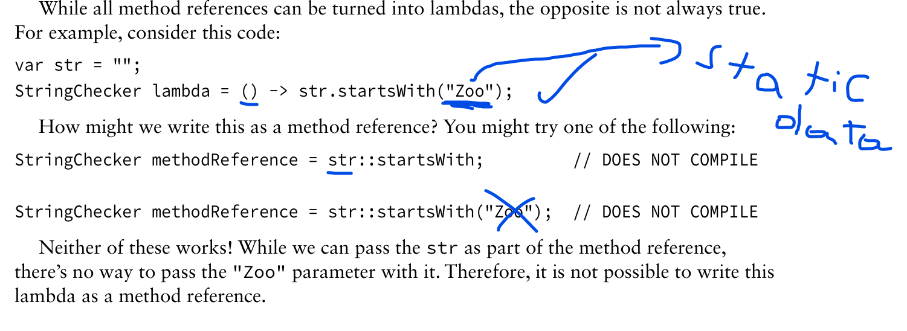
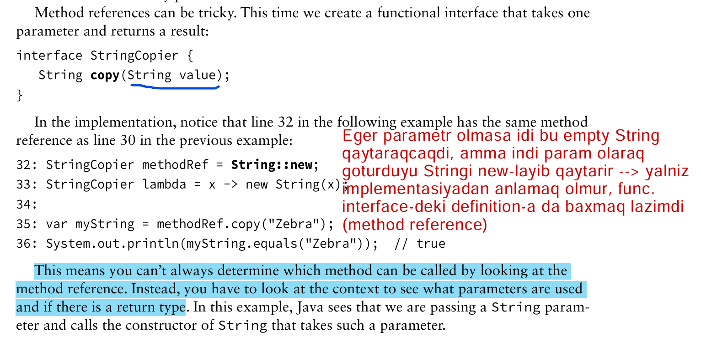
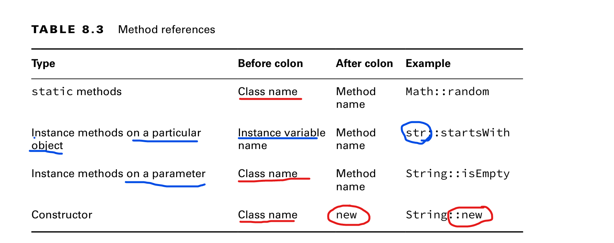

Remember that :: is like a lambda, and it is used for deferred execution
with a functional interface. You can even imagine the method reference
as a lambda if it helps you.
A method reference and a lambda behave the same way at runtime. You can pretend the
compiler turns your method references into lambdas for you.

There are four formats for method references:
- Static methods
- Instance methods on a particular object
- Instance methods on a parameter to be determined at runtime
- Constructors

While all method references can be turned into lambdas, the opposite is not always true.

---

---
